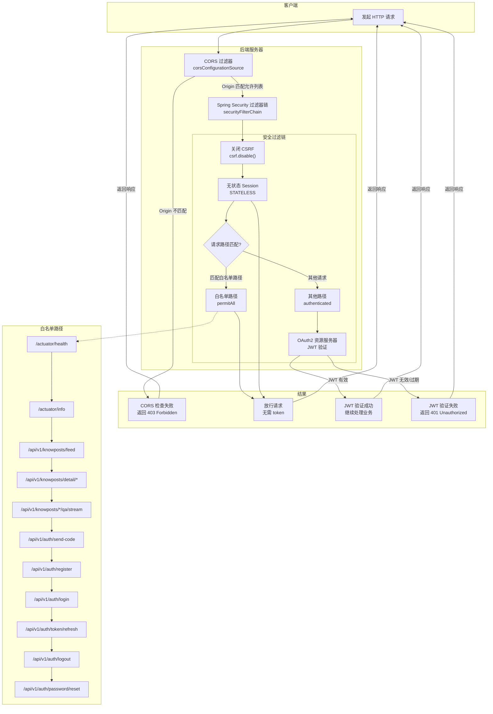

```mermaid
flowchart TD
    subgraph Client[客户端]
        A[发起 HTTP 请求]
    end

    subgraph Backend[后端服务器]
        B["CORS 过滤器\ncorsConfigurationSource"]
        C["Spring Security 过滤器链\nsecurityFilterChain"]

        subgraph SecurityFilterChain[安全过滤链]
            D1["关闭 CSRF\ncsrf.disable()"]
            D2["无状态 Session\nSTATELESS"]
            D3{请求路径匹配?}
            D4["白名单路径\npermitAll"]
            D5["其他路径\nauthenticated"]
            D6["OAuth2 资源服务器\nJWT 验证"]
        end
    end

    subgraph Result[结果]
        E1["CORS 检查失败\n返回 403 Forbidden"]
        E2["放行请求\n无需 token"]
        E3["JWT 验证成功\n继续处理业务"]
        E4["JWT 验证失败\n返回 401 Unauthorized"]
    end

    A --> B
    B -->|Origin 匹配允许列表| C
    B -->|Origin 不匹配| E1
    E1 -->|返回响应| A

    C --> D1 --> D2 --> D3

    D3 -->|匹配白名单路径| D4
    D3 -->|其他请求| D5

    D4 --> E2
    D2 --> E2  

    D5 --> D6
    D6 -->|JWT 有效| E3
    D6 -->|JWT 无效/过期| E4

    E2 -->|返回响应| A
    E3 -->|返回响应| A
    E4 -->|返回响应| A

subgraph Whitelist[白名单路径]
direction LR
F1["/actuator/health"]
F2["/actuator/info"]
F3["/api/v1/knowposts/feed"]
F4["/api/v1/knowposts/detail/*"]
F5["/api/v1/knowposts/*/qa/stream"]
F6["/api/v1/auth/send-code"]
F7["/api/v1/auth/register"]
F8["/api/v1/auth/login"]
F9["/api/v1/auth/token/refresh"]
F10["/api/v1/auth/logout"]
F11["/api/v1/auth/password/reset"]

F1 --> F2 --> F3 --> F4 --> F5 --> F6 --> F7 --> F8 --> F9 --> F10 --> F11
end

D4 -.-> F1
```