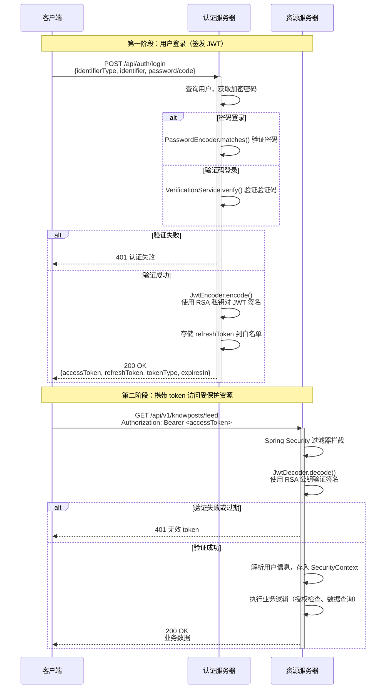

```mermaid
sequenceDiagram
    participant Client as 客户端
    participant AuthServer as 认证服务器
    participant ResourceServer as 资源服务器

    Note over Client,ResourceServer: 第一阶段：用户登录（签发 JWT）

    Client->>AuthServer: POST /api/auth/login<br/>{identifierType, identifier, password/code}
    activate AuthServer
    AuthServer->>AuthServer: 查询用户，获取加密密码
    alt 密码登录
        AuthServer->>AuthServer: PasswordEncoder.matches() 验证密码
    else 验证码登录
        AuthServer->>AuthServer: VerificationService.verify() 验证验证码
    end
    alt 验证失败
        AuthServer-->>Client: 401 认证失败
    else 验证成功
        AuthServer->>AuthServer: JwtEncoder.encode()<br/>使用 RSA 私钥对 JWT 签名
        AuthServer->>AuthServer: 存储 refreshToken 到白名单
        AuthServer-->>Client: 200 OK<br/>{accessToken, refreshToken, tokenType, expiresIn}
    end
    deactivate AuthServer

    Note over Client,ResourceServer: 第二阶段：携带 token 访问受保护资源

    Client->>ResourceServer: GET /api/v1/knowposts/feed<br/>Authorization: Bearer <accessToken>
    activate ResourceServer
    ResourceServer->>ResourceServer: Spring Security 过滤器拦截
    ResourceServer->>ResourceServer: JwtDecoder.decode()<br/>使用 RSA 公钥验证签名
    alt 验证失败或过期
        ResourceServer-->>Client: 401 无效 token
    else 验证成功
        ResourceServer->>ResourceServer: 解析用户信息，存入 SecurityContext
        ResourceServer->>ResourceServer: 执行业务逻辑（授权检查、数据查询）
        ResourceServer-->>Client: 200 OK<br/>业务数据
    end
    deactivate ResourceServer
```