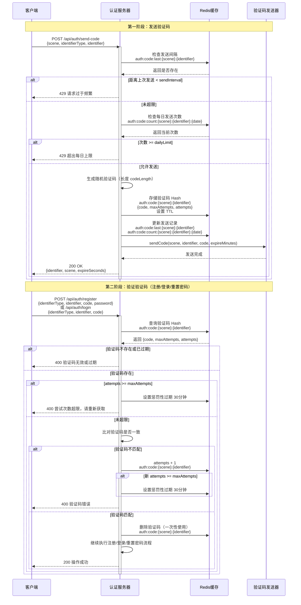

```mermaid
sequenceDiagram
    participant Client as 客户端
    participant AuthServer as 认证服务器
    participant Redis as Redis缓存
    participant CodeSender as 验证码发送器

    Note over Client,CodeSender: 第一阶段：发送验证码

    Client->>AuthServer: POST /api/auth/send-code<br/>{scene, identifierType, identifier}
    activate AuthServer
    AuthServer->>Redis: 检查发送间隔<br/>auth:code:last:{scene}:{identifier}
    Redis-->>AuthServer: 返回是否存在
    alt 距离上次发送 < sendInterval
        AuthServer-->>Client: 429 请求过于频繁
    else 未超限
        AuthServer->>Redis: 检查每日发送次数<br/>auth:code:count:{scene}:{identifier}:{date}
        Redis-->>AuthServer: 返回当前次数
        alt 次数 >= dailyLimit
            AuthServer-->>Client: 429 超出每日上限
        else 允许发送
            AuthServer->>AuthServer: 生成随机验证码（长度 codeLength）
            AuthServer->>Redis: 存储验证码 Hash<br/>auth:code:{scene}:{identifier}<br/>{code, maxAttempts, attempts}<br/>设置 TTL
            AuthServer->>Redis: 更新发送记录<br/>auth:code:last:{scene}:{identifier}<br/>auth:code:count:{scene}:{identifier}:{date}
            AuthServer->>CodeSender: sendCode(scene, identifier, code, expireMinutes)
            CodeSender-->>AuthServer: 发送完成
            AuthServer-->>Client: 200 OK<br/>{identifier, scene, expireSeconds}
        end
    end
    deactivate AuthServer

    Note over Client,CodeSender: 第二阶段：验证验证码（注册/登录/重置密码）

    Client->>AuthServer: POST /api/auth/register<br/>{identifierType, identifier, code, password}<br/>或 /api/auth/login<br/>{identifierType, identifier, code}
    activate AuthServer
    AuthServer->>Redis: 查询验证码 Hash<br/>auth:code:{scene}:{identifier}
    Redis-->>AuthServer: 返回 {code, maxAttempts, attempts}
    alt 验证码不存在或已过期
        AuthServer-->>Client: 400 验证码无效或过期
    else 验证码存在
        alt attempts >= maxAttempts
            AuthServer->>Redis: 设置惩罚性过期 30分钟
            AuthServer-->>Client: 400 尝试次数超限，请重新获取
        else 未超限
            AuthServer->>AuthServer: 比对验证码是否一致
            alt 验证码不匹配
                AuthServer->>Redis: attempts + 1<br/>auth:code:{scene}:{identifier}
                alt 新 attempts >= maxAttempts
                    AuthServer->>Redis: 设置惩罚性过期 30分钟
                end
                AuthServer-->>Client: 400 验证码错误
            else 验证码匹配
                AuthServer->>Redis: 删除验证码（一次性使用）<br/>auth:code:{scene}:{identifier}
                AuthServer->>AuthServer: 继续执行注册/登录/重置密码流程
                AuthServer-->>Client: 200 操作成功
            end
        end
    end
    deactivate AuthServer
```