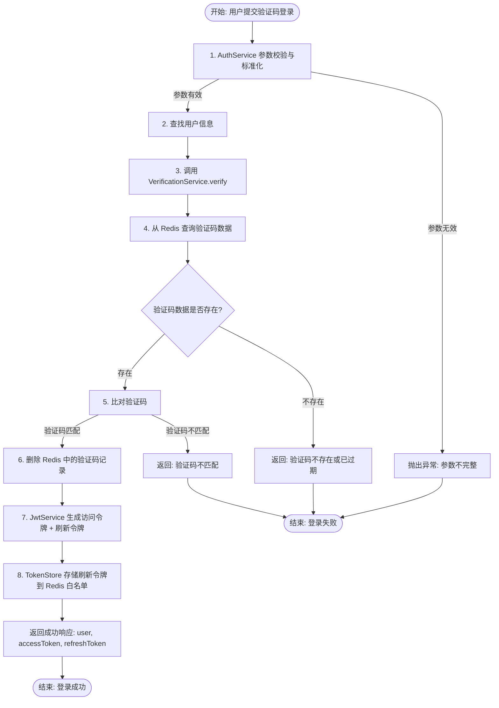

```mermaid
flowchart TD
    Start([开始: 用户提交验证码登录]) --> ParamCheck[1. AuthService 参数校验与标准化]

    ParamCheck -->|参数无效| ErrorParam[抛出异常: 参数不完整]
    ParamCheck -->|参数有效| FindUser[2. 查找用户信息]

    FindUser --> CallVerify[3. 调用 VerificationService.verify]
    CallVerify --> RedisQuery[4. 从 Redis 查询验证码数据]

    RedisQuery --> CodeExist{验证码数据是否存在?}
    CodeExist -->|不存在| ErrorCodeNotFound[返回: 验证码不存在或已过期]
    CodeExist -->|存在| CompareCode[5. 比对验证码]

    CompareCode -->|验证码匹配| DeleteRedis[6. 删除 Redis 中的验证码记录]
    CompareCode -->|验证码不匹配| ErrorMismatch[返回: 验证码不匹配]

    DeleteRedis --> GenJWT[7. JwtService 生成访问令牌 + 刷新令牌]
    GenJWT --> StoreRefresh[8. TokenStore 存储刷新令牌到 Redis 白名单]
    StoreRefresh --> SuccessResp[返回成功响应: user, accessToken, refreshToken]

    SuccessResp --> EndSuccess([结束: 登录成功])
    ErrorParam --> EndError([结束: 登录失败])
    ErrorCodeNotFound --> EndError
    ErrorMismatch --> EndError
```