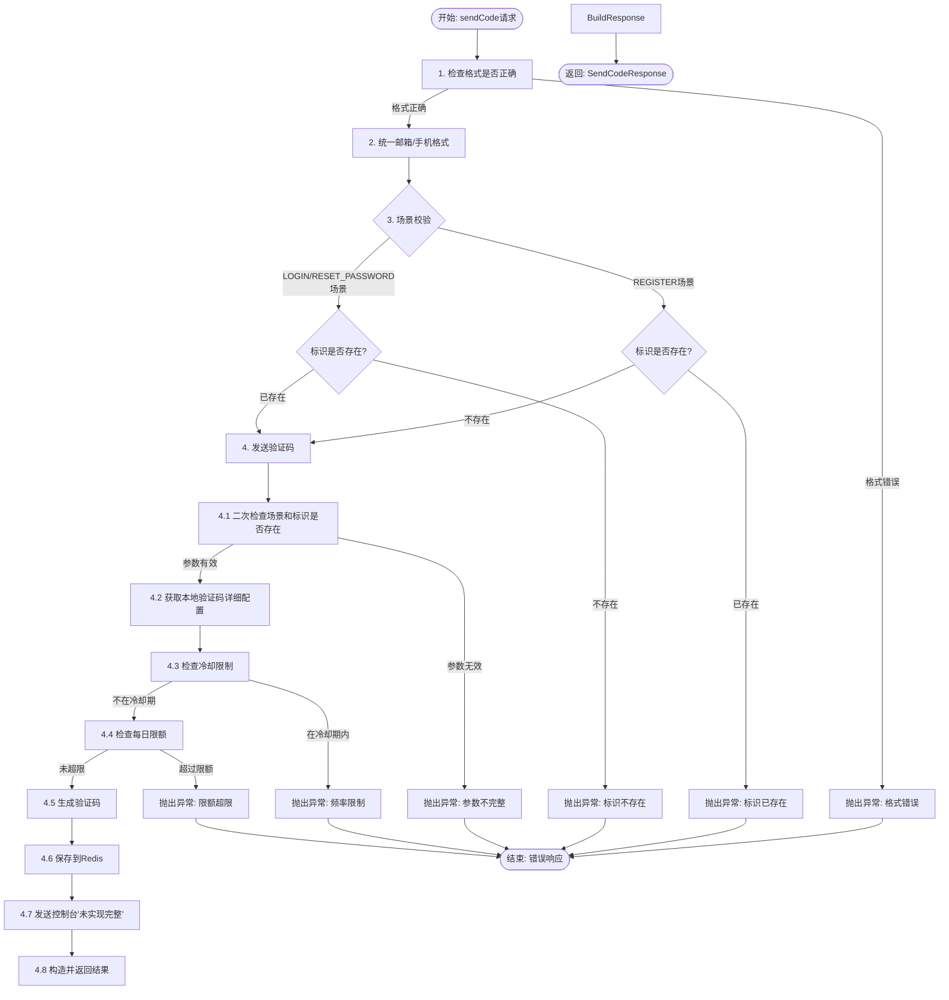

```mermaid
flowchart TD
    Start([开始: sendCode请求]) --> ValidateFormat[1. 检查格式是否正确]

    ValidateFormat -->|格式错误| ErrorFormat[抛出异常: 格式错误]
    ValidateFormat -->|格式正确| Normalize[2. 统一邮箱/手机格式]

    Normalize --> CheckScene{3. 场景校验}

    CheckScene -->|REGISTER场景| CheckRegister{标识是否存在?}
    CheckScene -->|LOGIN/RESET_PASSWORD场景| CheckLogin{标识是否存在?}

    CheckRegister -->|已存在| ErrorExists[抛出异常: 标识已存在]
    CheckRegister -->|不存在| SendCode[4. 发送验证码]

    CheckLogin -->|不存在| ErrorNotFound[抛出异常: 标识不存在]
    CheckLogin -->|已存在| SendCode

    SendCode --> ParamCheck[4.1 二次检查场景和标识是否存在]
    ParamCheck -->|参数无效| ErrorParam[抛出异常: 参数不完整]
    ParamCheck -->|参数有效| GetConfig[4.2 获取本地验证码详细配置]

    GetConfig --> CheckInterval[4.3 检查冷却限制]
    CheckInterval -->|在冷却期内| ErrorInterval[抛出异常: 频率限制]
    CheckInterval -->|不在冷却期| CheckDaily[4.4 检查每日限额]

    CheckDaily -->|超过限额| ErrorDaily[抛出异常: 限额超限]
    CheckDaily -->|未超限| GenerateCode[4.5 生成验证码]

    GenerateCode --> SaveCode[4.6 保存到Redis]
    SaveCode --> ActualSend[4.7 发送控制台'未实现完整']
    ActualSend --> BuildResult[4.8 构造并返回结果]

    BuildResponse --> End([返回: SendCodeResponse])

    ErrorFormat --> EndError([结束: 错误响应])
    ErrorExists --> EndError
    ErrorNotFound --> EndError
    ErrorParam --> EndError
    ErrorInterval --> EndError
    ErrorDaily --> EndError
```