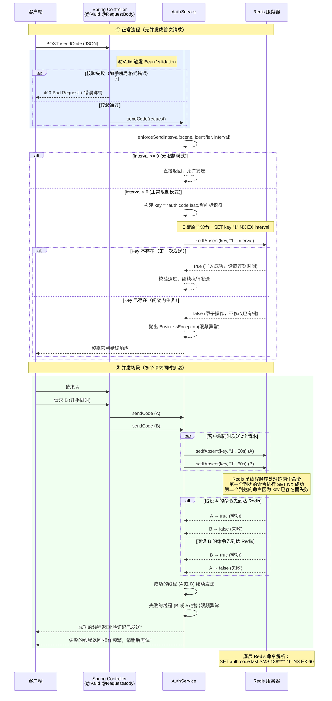

```mermaid
sequenceDiagram
    participant Client as 客户端
    participant Controller as Spring Controller<br/>(@Valid @RequestBody)
    participant Service as AuthService
    participant Redis as Redis 服务器

    Note over Client,Redis: ① 正常流程（无并发或首次请求）
    Client->>Controller: POST /sendCode (JSON)

    rect rgb(230, 240, 255)
        Note right of Controller: @Valid 触发 Bean Validation
        alt 校验失败（如手机号格式错误）
            Controller-->>Client: 400 Bad Request + 错误详情
        else 校验通过
            Controller->>Service: sendCode(request)
        end
    end

    Service->>Service: enforceSendInterval(scene, identifier, interval)

    alt interval <= 0 (无限制模式)
        Service-->>Service: 直接返回，允许发送
    else interval > 0 (正常限制模式)
        Service->>Service: 构建 key = "auth:code:last:场景:标识符"

        Note over Service,Redis: 关键原子命令：SET key "1" NX EX interval
        Service->>Redis: setIfAbsent(key, "1", interval)

        alt Key 不存在（第一次发送）
            Redis-->>Service: true (写入成功，设置过期时间)
            Service-->>Service: 校验通过，继续执行发送
        else Key 已存在（间隔内重复）
            Redis-->>Service: false (原子操作，不修改已有键)
            Service-->>Service: 抛出 BusinessException(限频异常)
            Service-->>Client: 频率限制错误响应
        end
    end

    Note over Client,Redis: ② 并发场景（多个请求同时到达）
    rect rgb(240, 255, 240)
        Client->>Controller: 请求 A
        Client->>Controller: 请求 B (几乎同时)

        Controller->>Service: sendCode (A)
        Controller->>Service: sendCode (B)

        par 客户端同时发送2个请求
            Service->>Redis: setIfAbsent(key, "1", 60s) (A)
            Service->>Redis: setIfAbsent(key, "1", 60s) (B)
        end

        Note over Redis: Redis 单线程顺序处理这两个命令<br/>第一个到达的命令执行 SET NX 成功<br/>第二个到达的命令因为 key 已存在而失败

        alt 假设 A 的命令先到达 Redis
            Redis-->>Service: A → true (成功)
            Redis-->>Service: B → false (失败)
        else 假设 B 的命令先到达 Redis
            Redis-->>Service: B → true (成功)
            Redis-->>Service: A → false (失败)
        end

        Service->>Service: 成功的线程 (A 或 B) 继续发送
        Service->>Service: 失败的线程 (B 或 A) 抛出限频异常

        Service-->>Client: 成功的线程返回“验证码已发送”
        Service-->>Client: 失败的线程返回“操作频繁，请稍后再试”
    end

    Note over Redis: 底层 Redis 命令解析：<br/>SET auth:code:last:SMS:138**** "1" NX EX 60
```