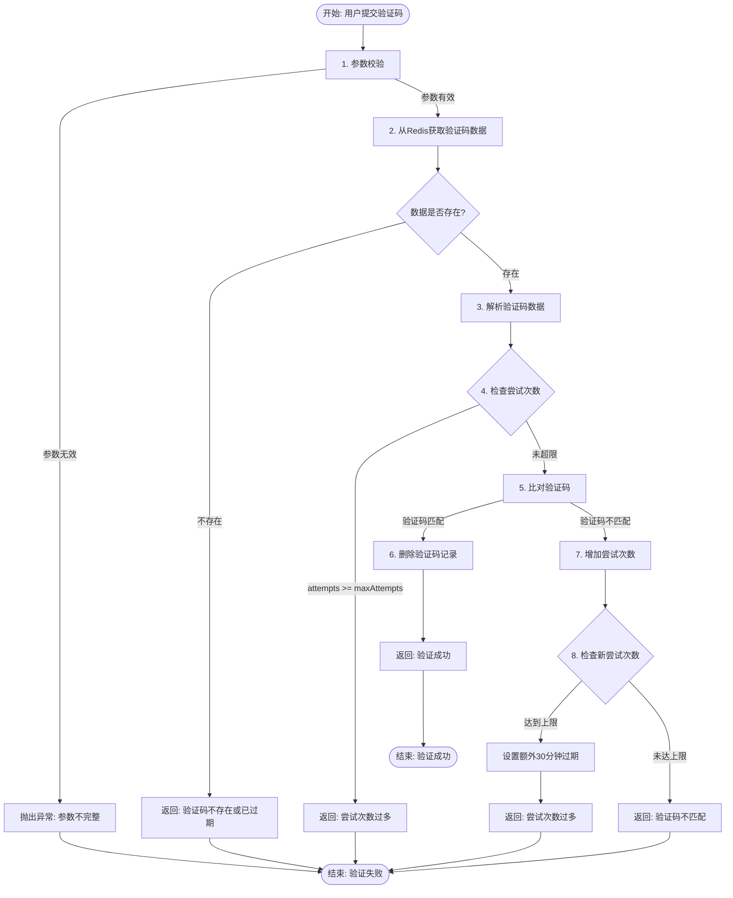

```mermaid
flowchart TD
    Start([开始: 用户提交验证码]) --> VerifyParam[1. 参数校验]

    VerifyParam -->|参数无效| ErrorParam[抛出异常: 参数不完整]
    VerifyParam -->|参数有效| GetRedisData[2. 从Redis获取验证码数据]

    GetRedisData --> CheckEmpty{数据是否存在?}
    CheckEmpty -->|不存在| ErrorNotFound[返回: 验证码不存在或已过期]
    CheckEmpty -->|存在| ParseData[3. 解析验证码数据]

    ParseData --> CheckAttempts{4. 检查尝试次数}
    CheckAttempts -->|attempts >= maxAttempts| ErrorTooMany[返回: 尝试次数过多]
    CheckAttempts -->|未超限| CompareCode[5. 比对验证码]

    CompareCode -->|验证码匹配| DeleteCode[6. 删除验证码记录]
    CompareCode -->|验证码不匹配| IncrementAttempts[7. 增加尝试次数]

    DeleteCode --> Success[返回: 验证成功]

    IncrementAttempts --> CheckNewAttempts{8. 检查新尝试次数}
    CheckNewAttempts -->|达到上限| SetExpire[设置额外30分钟过期]
    CheckNewAttempts -->|未达上限| ReturnMismatch[返回: 验证码不匹配]

    SetExpire --> ErrorTooManyNew[返回: 尝试次数过多]

    Success --> EndSuccess([结束: 验证成功])
    ErrorNotFound --> EndError([结束: 验证失败])
    ErrorTooMany --> EndError
    ErrorTooManyNew --> EndError
    ReturnMismatch --> EndError
    ErrorParam --> EndError


```