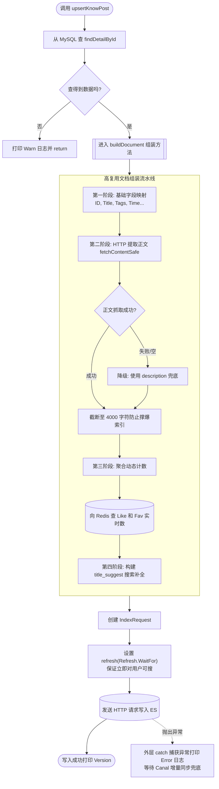

```mermaid
flowchart TD
    Start([调用 upsertKnowPost]) --> CheckDB[从 MySQL 查 findDetailById]
    
    CheckDB --> IsNull{查得到数据吗?}
    IsNull -- "否" --> LogWarn[打印 Warn 日志并 return]
    IsNull -- "是" --> EnterBuild[[进入 buildDocument 组装方法]]
    
    subgraph buildDocument [高复用文档组装流水线]
        direction TB
        Phase1[第一阶段: 基础字段映射<br/>ID, Title, Tags, Time...] --> Phase2
        
        Phase2[第二阶段: HTTP 提取正文 fetchContentSafe]
        Phase2 --> CheckBody{正文抓取成功?}
        CheckBody -- "失败/空" --> FallbackBody[降级: 使用 description 兜底]
        CheckBody -- "成功" --> TruncateBody[截断至 4000 字符防止撑爆索引]
        FallbackBody --> TruncateBody
        
        TruncateBody --> Phase3[第三阶段: 聚合动态计数]
        Phase3 --> CallRedis[(向 Redis 查 Like 和 Fav 实时数)]
        CallRedis --> Phase4[第四阶段: 构建 title_suggest 搜索补全]
    end
    
    EnterBuild --> buildDocument
    buildDocument --> CreateRequest[创建 IndexRequest]
    
    CreateRequest --> SetRefresh["设置 refresh(Refresh.WaitFor)<br/>保证立即对用户可搜"]
    SetRefresh --> CallES[(发送 HTTP 请求写入 ES)]
    CallES --> Finish([写入成功打印 Version])
    
    %% 异常捕获节点
    CallES -.->|抛出异常| CatchError[外层 catch 捕获异常打印 Error 日志<br/>等待 Canal 增量同步兜底]
    

```